# Minecraft CTF

A simple and straightforward 'Capture The Flag' minigame plugin. Built to fulfill assessment requirements.

## Setup & Compilation

### Prerequisites

- Java 21
- Gradle(optional)

### Build Steps / Setup

```bash
git clone [https://github.com/tjXJNOOBIE/Minecraft-CTF.git](https://github.com/tjXJNOOBIE/Minecraft-CTF.git)
cd Minecraft-CTF
./gradlew clean build
```

#### Run

1. After building, the compiled artifact/jar will be located in `ctf-paper/build/libs/`. Drop the jar into your PaperMC plugins folder and start the server.
2. You should load into the world and can do `/ctf join` to join a match. If not, follow admin commands to setup the arena and lobby.

<p align="center">
  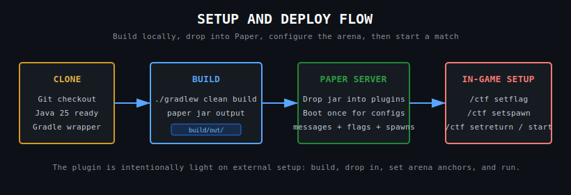
</p>

#### Setup Mechanics

To keep server setup predictable, the plugin uses a straightforward arena bootstrap flow driven by admin commands and config-backed positions.

- **Arena Anchors First:** Team spawns, flag points, return points, and the lobby are set explicitly so the match always boots from known locations.
- **Build Then Deploy:** The Gradle build produces the plugin artifact, which is then dropped into the Paper server before runtime setup begins.
- **Command-Led Initialization:** Setup stays operator-friendly by relying on a small admin command set instead of hidden startup assumptions.
- **Lobby As Entry Point:** Once the arena is configured, players funnel through the lobby flow and the match can transition into its normal lifecycle.

--

# Testing

I made a simple, yet effective, local Minecraft botnet (headless Mineflayer) while I was working on the code/tests/architecture simultaneously, very little extra time was spent on it, so it's unpolished, but works.

<p align="center">
  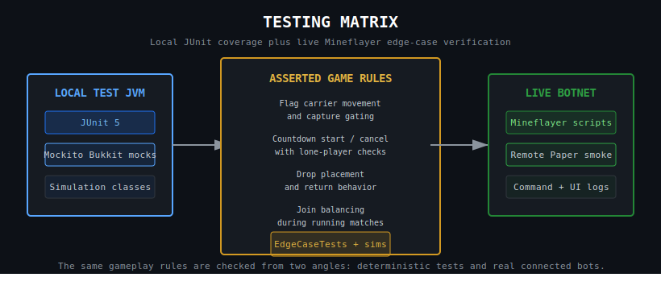
</p>

## About Testing

While I'm reviewing, writing code and doing edge case testing, I can use an autonomous local botnet to simulate players doing real actions in the game, with the option to join the match to debug.

- AI can compile, upload to remote, and run/update bot scripts and code autonomous while I handle other tasks.

- **Test ran on local (Windows) and remote (Linux/Ubuntu)**

### Bot Actions Include (debug actions only listed):

Bot actions include, but are not limited to:

- Full game simulations
- Arena building/setup
- Carrying/Capturing/Killing the flag
- Moving
- Attacking
- UI (actions, bossbar, titles, etc) Feedback
- PvP & Abilities
- Edge case testing (e.g. game state testing, inventory actions, etc)
- Read debug messages
- Produce per bot logs
- Use admin/player commands
- Different modes for different actions/simulations

### Local (IDE) Testing

#### Testing Stack

- **JUnit 5:** Core execution test suite.
- **Mockito:** Mocking for the Bukkit objects.

#### Local Game Simulation/Testing

Project employs integration/unit and full game simulation(s) written in JUnit 5.

- Tests can be found in: `ctf-paper/src/test/`
- Full Game Simulation Test class: 'FullPluginSimulationTest.java' / 'CTFGameSimulationTest.java'

```bash
  ./gradlew test --tests "*FullPluginSimulationTest" --info
  ./gradlew test --tests "*CTFGameSimulationTest" --info
```

--

# Gameplay

<p align="center">
  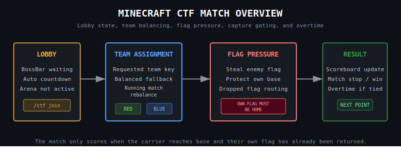
</p>

<p align="center">
  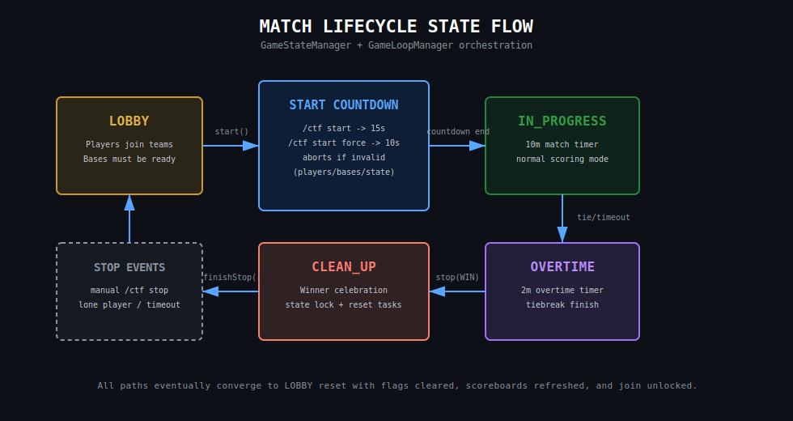
</p>

#### Match Mechanics

The match lifecycle is intentionally small and state-driven so the plugin can move cleanly between waiting, active play, and reset.

- **Lobby To Live Match:** Players enter from the lobby, teams are assembled, and the game transitions into an active round when conditions are met.
- **Active State Owns Gameplay:** Timers, score tracking, combat, flag events, and UI feedback all run under the in-progress match state.
- **Win Conditions Stay Centralized:** Score limits, timer expiry, and overtime logic are resolved through the main game orchestration flow.
- **Reset Is Deliberate:** Match-end cleanup returns players to a clean post-game state rather than carrying transient runtime state forward.

## Commands

### Player Commands

- Typing '/ctf join' alone will auto balance you to a team that's shorthanded.

```text
/ctf join [red/blue] - Join the CTF match (Typing '/ctf join' alone will auto balance you to a team that's shorthanded.)
/ctf leave - Leave the CTF match
/ctf score - View CTF match score
/ctf - View player command help menu (permission gated)
```

### Admin Commands

- **Certain admin commands had to be added for debugging.**
- 'ctf.admin' should be able to access all commands. (or OP)

```text
[] = Optional

/ctf setspawn [red/blue] - Set the spawn point for a team's base
/ctf setflag <red/blue> - Set the flag location for a team
/ctf setreturn <red/blue> - Set the flag return point(s) for a team.
/ctf removereturn <red/blue> - Remove a return point from a team.
/ctf setlobby - Set lobby spawn point for '/ctf join'
/ctf setgametime - Set match timer
/ctf setscore <red/blue> <int/score> - Set match score for a team
/ctf setscorelimit <int/score-limit> - Set match score limit
/ctf start - Start the match
/ctf stop - Stop the match
/ctf debug - Send plugin debug messages to admins
/ctf canbuild - Set build toggle for admin
/ctf simulate - May not work on you machine, use provided scripts. Stats a botted match simulation for debugging and joining.
```

## Gameplay UX

### Feedback

Feedback from our game is VERY important when it comes to giving the user an immersive experience that feels like a game

#### Player Flag Feedback

- Sounds/Titles for all players on:
  - Flag drop, flag pickup, flag capture, and flag return
  - "Bad" sounds play for negative events like flag dropping for your team and vice versa for positive events.
- Particle/firework effects on flag capture, dropping and returning
- Floating + Glowing flag indicator to easily find the flag
- Dropped flags show up on our EXP Indicator
- When carrying the flag, a base indicator lives in the EXP bar for the player to follow.
  - Flag carrier also has EXP and bossbar info for navigating to your base or a dropped flag.

<p align="center">
  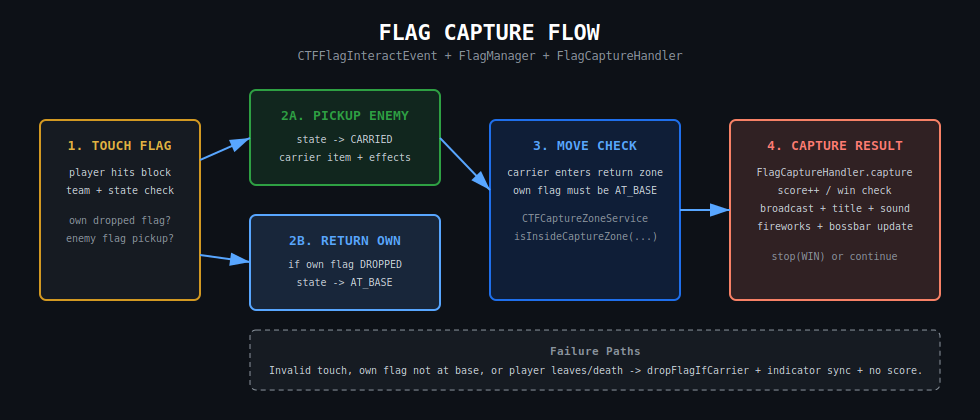
</p>

#### Flag Mechanics

Flag handling is one of the main gameplay loops, so pickup, drop, return, and capture events are routed through a controlled state flow.

- **Event-Driven State Changes:** Flag actions are processed through guarded event logic instead of scattered handler-side mutations.
- **Carrier Feedback Is Immediate:** Once a player takes a flag, EXP, bossbar, sounds, and title cues help direct the next objective.
- **Dropped Flags Stay Visible:** A dropped flag remains a live objective with visual guidance so both teams can react quickly.
- **Scoring Flows From Capture Events:** Successful returns and captures feed directly into the score system and broader match progression.

#### Base Feedback

- Floating + Glowing base indicator to easily find the base
- EXP Bar shows base location in green
- Return points are particle rings that are different colors/particles for each team

#### Winner Feedback

- A winner celebration includes a firework show from every winning player on the team.

#### Player Death/Kill Feedback

- UI Flash when killing a player. Action or BossBar
- General killfeed
- Special death message for indirect homing spear kills
- No death screens (instant respawning)

#### Scoreboard Feedback

- Show scores, time remaining, team player count, kills/deaths, and cooldowns (only when active)
- Two different scoreboards are used, one for LOBBY and one for IN_PROGRESS.

<p align="center">
  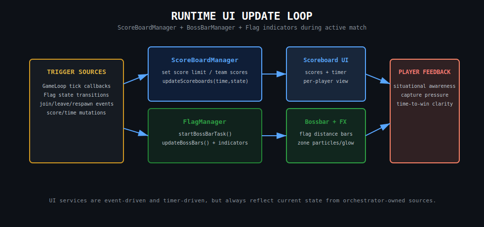
</p>

#### UI Mechanics

The runtime UI loop is built to mirror match state continuously so players always have a readable objective and current combat context.

- **State Drives Presentation:** Scoreboards, bossbars, titles, action feedback, and sounds are all emitted from live gameplay events.
- **Lobby And Match Stay Separate:** Different scoreboard modes prevent waiting-room information from leaking into the active round UI.
- **Objective Guidance Is Contextual:** Carrier direction, dropped-flag hints, timers, and cooldown feedback only surface when relevant.
- **Fast Feedback Matters:** Immediate visual and audio responses make combat and scoring events legible without relying on chat alone.

#### General Match Feedback

- BossBar for players waiting to join in LOBBY
- Countdown sounds based on if the match is about to start or end
- Nice start match and end match sounds

#### Ties

- The game will go into overtime instead of just ending in a tie. (Edge case)
  - This results in a sudden death, next point wins.

#### Player Stats

- Player stats are not persisted over restarts/reloads for simplicity.
- Players have per match stats that don't reset when doing '/ctf leave', only when the match ends.

#### Simple Kits, Simple Abilities

- Scout Kit - Default kit
  - Throws snowballs from sword to tag (glow) the target for X seconds
- Ranger Kit - Ranged weapon kit
  - Can press F throw and turn the trident(Homing Spear) into a homing missile
  - Can be thrown vanilla like a spear, returns after a cooldown

- Effects Package (Most): 'dev.tjxjnoobie.ctf.util.bukkit'

<p align="center">
  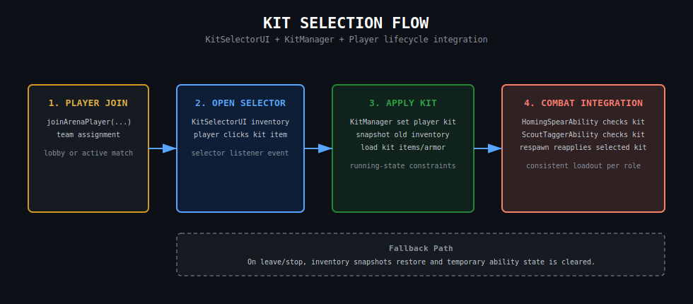
</p>

#### Kit Mechanics

Kits stay intentionally lightweight so they add role variety without introducing a large class system or heavy balance surface area.

- **Scout As Baseline:** The default scout kit provides a simple utility-oriented playstyle built around mobility and target marking.
- **Ranger As Skill Shot Option:** The ranger kit adds a more specialized ranged loop with its homing spear ability and cooldown rhythm.
- **Abilities Plug Into Core Combat:** Kit actions still route through the same match, cooldown, and feedback systems as the rest of gameplay.
- **Simple Roles, Clear UX:** The kit flow prioritizes readability and immediate player understanding.

--

# Architecture

To keep things simple, no real persistence, frameworks, custom libraries, abstractions, or complex architecture was created. We use simple Paper API features to make the game feel alive.

<p align="center">
  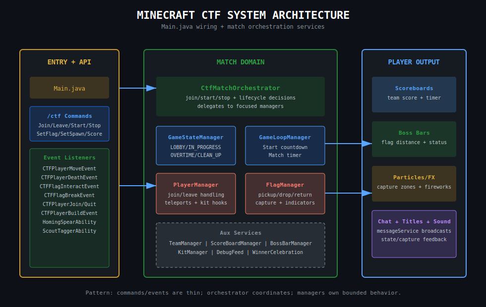
</p>

#### System Layout

The system architecture stays intentionally direct: isolate domains, keep services readable, and let Paper-native mechanics do most of the work.

- **Domain Separation First:** Commands, events, config, gameplay, and utility concerns are split into focused packages instead of merged into a single controller layer.
- **Composition Over Frameworks:** Lightweight dependency composition replaces heavy containers, preserving explicit boot order and debuggability.
- **Runtime Systems Stay Small:** Match orchestration, task scheduling, and event routing each own a narrow slice of behavior.
- **Practical Testability:** The same layout that keeps the plugin readable also makes it easier to swap dependencies during simulation and local tests.

<p align="center">
  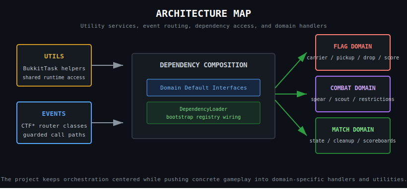
</p>

#### Architecture Mechanics

The architecture map shows how the plugin is split into practical gameplay domains so each subsystem can stay small, readable, and easy to reason about.

- **Core Domains Stay Distinct:** Commands, events, gameplay, config, dependency wiring, and Bukkit-facing utilities each sit in their own functional area.
- **Gameplay Flows Through Boundaries:** Match logic interacts with other systems through clear domain seams instead of one large all-knowing class.
- **Cross-Cutting Utilities Stay Shared:** Common helpers and keys are reused across domains without collapsing those domains together.
- **Readability Is The Main Goal:** The layout favors maintainability and fast debugging over abstract layering or framework-heavy indirection.

### General Code Standards

- The project tries to use simple, yet effective patterns to make the project readable for other developers and my future-self.
- Decoupling is strongly encouraged by not making god classes/objects, centralizing things like BukkitTask, create 'Util' classes by domain, default interface for deps, and global keys (CTFKeys.java).
  - Example: ''
- I try to remain as DRY and OOP as possible with the scope constraints.
- I view type-safety as very important to maintaining a software. I try to employ type-safety as much as I could without touching Java generics to keep things simple. Maps try to store custom data objects instead of raw Java objects, with exception to our DI map.
- "Clean Code" principles are followed as much as possible. e.g. No magic numbers, meaningful variable names, no god classes, etc.
- Classes are structured for readability and prioritized for DX (Developer Experience) with inline documentation and docstring/javadoc.

## Dependency Injection

Injection was kept simple and straightforward. Dependencies are composed through our loader then continue to use "Domain Default Interfaces". Behavior/Consumers can implement the interface they need and call methods via default methods in the interface. State is isolated, avoiding constructor bloat and relying on stateless default methods for composition. Employs a concurrent map for DI storage and a LinkedList for DI load order.

- Example: 'PlayerDependencyAccess.java', 'DependencyLoader.java'
- Package: 'dev.tjxjnoobie.ctf.dependency'

<p align="center">
  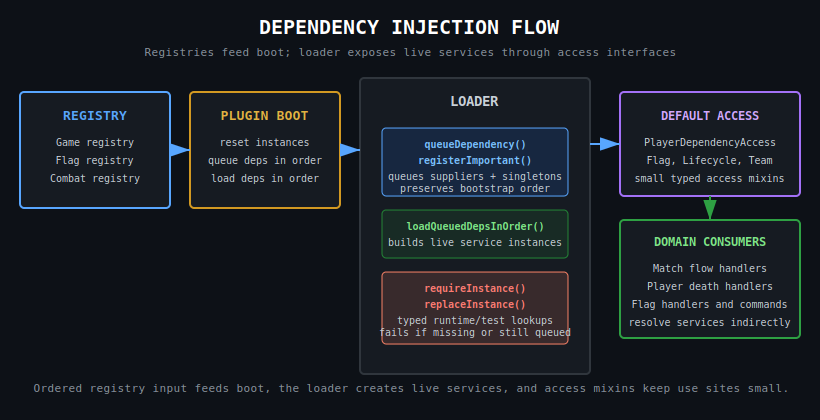
</p>

#### System Mechanics

To maintain strict domain isolation and avoid heavy frameworks, this project utilizes a custom **Domain Default Interface** composition pattern for dependency injection.

- **No Constructor Bloat:** Domain handlers and commands do not require 15 arguments in their constructors. Dependencies are mixed in via lightweight interfaces (e.g., `PlayerDependencyAccess.java`).
- **Deterministic Bootstrapping:** Services are queued and loaded in a strict, guaranteed order by the `DependencyLoader.java`.
- **Testability via Replacement:** The `replaceInstance()` method allows our JUnit E2E simulation to dynamically swap
  live Bukkit dependencies with Mockito proxies at runtime, entirely bypassing the need for a live server.
- **Failure Mode:** The 'findInstance()' method allows for dependencies to either be loaded, and if not found, an instance is created for whoever called it to use.

--

### Event Routing

Handling multiple Bukkit events is a common source of race conditions and general pain. Instead, I built a simple event 'routing' system to prevent this. Event calling is handled by one central CTF\*Event class that has guards to determine if and what event should be called.

- Example: 'CTF\*Event.java' classes + their inherited interfaces
- Package: 'dev.tjxjnoobie.ctf.events'

### Command Execution

Basic permissions are applied to commands to stop abuse. Command execution/tab completion is handled by one central 'CTF' Command class. Subcommands are handled by this 'CTF' class as well. Most command classes stay clean of real state or lifecycle logic.

- Example: 'CTF.java'
- Package: 'dev.tjxjnoobie.ctf.commands'

### Configuration

We separated configs by domain. Flag spawns, indicators spawns, base spawns and a message config. All self explanatory.

- 'MessageConfigHandler.java' is an example of how all our config handlers work.
- Package: 'dev.tjxjnoobie.ctf.config'

### Game Loop

We centralize BukkitTasks in 'BukkitTaskOrchestrator.java' for easy timer canceling and task centralizing.
There are various handlers, a 'GameLoopTimer.java' class and game orchestration class to control the game loop.

- Example: 'CTFOrchestrator.java'
- Example: 'GameLoopTimer.java'
- Package: 'dev.tjxjnoobie.ctf.game'

<p align="center">
  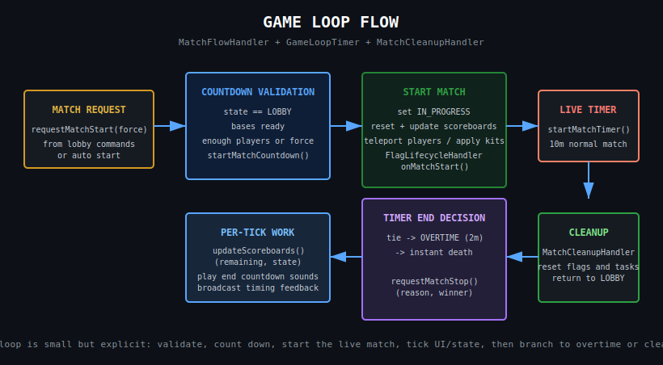
</p>

#### Loop Mechanics

The game loop is centralized so match timing, recurring updates, and cleanup all run through one predictable orchestration path.

- **Task Ownership Stays Explicit:** Repeating timers and scheduled match work are registered through the task orchestrator instead of being scattered across handlers.
- **Round State Advances Predictably:** The loop is responsible for countdowns, active-match ticking, overtime handling, and end-of-round transitions.
- **Cleanup Is Built In:** Central task tracking makes it easier to cancel timers and reset runtime state when a match stops or restarts.
- **Gameplay Systems Hook Into The Loop:** Score updates, UI refreshes, and other recurring match behaviors stay synchronized with the same runtime cadence.

### Abstraction

- No custom abstraction was used to keep the project simple and within constraints.

--

# Improvements

There's always areas to improve, but we need to keep things simple and deadline friendly. Here are some that I can think of off the top of my head that can be improved:

- Data Persistence; Introduction of Postgres/SQL
- Full Game Instance; This game has the markings to be a single instance experience.
- Caching; Introduction of an in-memory caching system
- Player UX; Progression, badges, map buffs/debuffs, leaderboards, stats, spectator system, etc.
- DX/Testing; Better bots for more realistic testing and edge case scripts. A cluster of servers with botnets to soak test from different geo locations. Run multiple different type of edge case tests on multiple servers. One "fixer" AI on standby to fix bugs from all servers logs and run CI/DI again and repeat.
